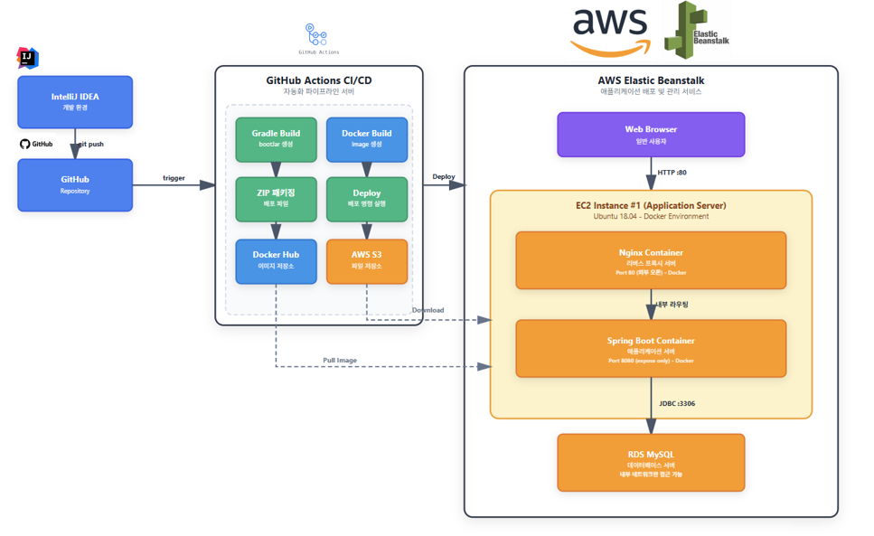

## [Spring-Boot-Portfolio] JPA & AWS 기반 게시판 프로젝트 & 심층 학습 기록

안녕하세요. 이 레포지토리는 **Spring Boot**를 활용하여 백엔드 개발 역량을 쌓고, 그 과정에서 얻은 기술적 이해를 상세히 기록한 **지식 포트폴리오**입니다. 단순히 코드를 넘어, 프레임워크의 원리와 설계 과정에 대한 깊이 있는 고민을 담았습니다.

---
## 🏗️ 시스템 아키텍처


> Spring Boot 게시판 프로젝트의 전체 CI/CD 파이프라인 및 배포 구조

## 📚 프로젝트 상세 문서
프로젝트의 구현 과정, 기능별 상세 설명, 발생한 이슈와 해결 방법을 확인하실 수 있습니다.

### [📖 Spring Board Project - 상세 구현 가이드 보기](./spring-boot-project/project_info.md)

주요 내용:
- 회원가입 및 로그인 구현
- 게시판 CRUD 기능
- 관리자 페이지 구현
- 페이징 처리

## 🎬 프로젝트 시연 영상

### 📱 애플리케이션 실행 데모
[](https://youtu.be/9Fm3FfhFaMQ)
> 🔗 **[전체 기능 시연 보기](https://youtu.be/9Fm3FfhFaMQ)** - 게시판 CRUD, 로그인/권한 관리, RESTful API 동작 확인

### 🚀 CI/CD 자동 배포 과정
[](https://youtu.be/TQRcmNF6O1g)
> 🔗 **[GitHub Actions 배포 과정 보기](https://youtu.be/TQRcmNF6O1g)** - Git Push부터 AWS EC2 자동 배포까지 전 과정

---

## 1. 프로젝트 개요 (Overview)

책 『이것이 스프링 부트다 with 자바』를 기반으로, 데이터베이스 연동부터 클라우드 배포까지 백엔드 개발의 전 과정을 실습했습니다. 핵심 게시판 애플리케이션을 완성하며 실무에 필요한 기술 스택을 통합적으로 익히는 데 중점을 두었습니다.

### 주요 기능
- **게시글 관리 (CRUD)**: Spring Data JPA를 활용한 영속성 관리
- **사용자 인증/인가**: Spring Security를 이용한 안전한 로그인 및 권한 관리
- **RESTful API**: 프론트엔드 연동을 위한 규격화된 API 설계
- **클라우드 배포**: Docker 컨테이너를 이용한 AWS EC2 환경 배포
- **CI/CD 파이프라인**: GitHub Actions를 활용한 자동화된 빌드 및 배포

### 사용 기술 스택
- **Backend**: Java 21, Spring Boot 3.x
- **Database**: H2 (개발 환경), MySQL (운영 환경)
- **ORM**: Spring Data JPA
- **Security**: Spring Security
- **API/View**: Thymeleaf, RESTful API
- **Deployment**: AWS EC2, Docker
- **CI/CD**: GitHub Actions

---

## 2. 📚 심층 학습 노트 인덱스 (Study Notes Index)

프로젝트를 진행하며 각 챕터에서 학습한 **스프링 부트 핵심 원리와 개념**을 정리했습니다. (클릭하여 Markdown 노트를 확인하세요.)

| Part | Chapter | 주요 학습 내용 | 정리 노트 |
| :--- | :--- | :--- | :--- |
| **Part 1. 기초** | Ch 01 | 스프링 부트 이해, Auto-Configuration 원리 분석 | [노트 보기](./study-notes/01_Part_스프링부트의기초/01_스프링부트_이해하기.md) |
| | Ch 02 | 환경 설정, 컨테이너와 DI 원리 | [노트 보기](./study-notes/01_Part_스프링부트의기초/02_스프링부트_시작하기.md) |
| **Part 2. 개발** | Ch 03 | 데이터베이스 연결 및 JPA 개념 심화 | [노트 보기](./study-notes/02_Part_스프링부트애플리케이션개발/03_데이터베이스_연동하기.md) |
| | Ch 04 | RESTful API 설계 및 DTO 활용 | [노트 보기](./study-notes/02_Part_스프링부트애플리케이션개발/04_RESTful_API_작성하기.md) |
| | Ch 05 | **Spring Security**를 활용한 인증/인가 구현 | [노트 보기](./study-notes/02_Part_스프링부트애플리케이션개발/05_스프링부트로_게시판_만들기.md) |
| **Part 3. 배포** | Ch 06 | Profile 설정 및 JAR 빌드 전략 | [노트 보기](./study-notes/03_Part_빌드및배포/06_프로파일및빌드.md) |
| | Ch 07 | **AWS와 Docker**를 활용한 클라우드 배포 및 **GitHub Actions**를 사용한 CI/CD 자동배포 | [노트 보기](./study-notes/03_Part_빌드및배포/07_애플리케이션_배포하기.md) |

---

## 3. 💡 핵심 학습 포인트

이 프로젝트를 통해 특히 깊이 있게 학습하고 구현한 내용:

### 🔐 Spring Security 인증/인가
- FilterChain 기반의 인증 흐름 이해
- 사용자 권한별 접근 제어 구현
- 세션 기반 로그인 처리

### 🗄️ JPA & 영속성 관리
- 영속성 컨텍스트와 1차 캐시 메커니즘
- 연관관계 매핑 및 지연 로딩 전략
- JPQL을 활용한 복잡한 쿼리 작성

### 🐳 Docker & AWS 배포
- Dockerfile을 이용한 애플리케이션 컨테이너화
- AWS EC2 인스턴스 설정 및 배포
- 개발/운영 환경 분리 (Profile 활용)

### ⚙️ CI/CD 파이프라인 구축
- GitHub Actions를 활용한 자동 빌드
- Docker 이미지 자동 생성 및 배포
- 코드 Push → 빌드 → 배포 전 과정 자동화

---
## 4. 🔧 트러블슈팅

### 1. 회원 삭제 시 외래키 제약 조건 오류

#### 문제 상황
회원 삭제 기능 구현 중, 다음과 같은 오류가 발생했습니다:
```
SQLIntegrityConstraintViolationException: Cannot delete or update a parent row: 
a foreign key constraint fails
```

#### 원인 분석
- 회원(`member`) 테이블과 게시글(`article`) 테이블이 외래키로 연결되어 있음
- 게시글을 작성한 회원을 삭제하려고 할 때, 해당 회원이 작성한 게시글이 남아있어 외래키 제약 조건 위반
- 데이터베이스 무결성을 유지하기 위해 자식 데이터(게시글)가 존재하는 부모 데이터(회원)는 삭제할 수 없음

#### 해결 방법
`@Transactional`을 사용하여 **회원 삭제 전에 해당 회원이 작성한 모든 게시글을 먼저 삭제**하도록 순서를 변경했습니다.
```java
@Transactional
public void delete(Long id) {
    // 1. 회원 정보 조회
    Member member = memberRepository.findById(id).orElseThrow();
    
    // 2. 해당 회원이 작성한 모든 게시글 먼저 삭제 (자식 데이터 삭제)
    articleRepository.deleteAllByMember(member);
    
    // 3. 회원 삭제 (부모 데이터 삭제)
    memberRepository.deleteById(id);
}
```

#### 핵심 포인트
- 외래키 관계에서는 **자식 데이터를 먼저 삭제한 후 부모 데이터를 삭제**해야 함
- `@Transactional` 어노테이션으로 모든 작업이 하나의 트랜잭션으로 처리되어 원자성 보장
- 중간에 오류 발생 시 모든 작업이 롤백되어 데이터 무결성 유지

---

### 2. Docker 이미지 빌드 시 이름 규칙 위반 오류

#### 문제 상황
`gradlew bootBuildImage` 명령 실행 시 다음과 같은 오류가 발생했습니다:
```
Execution failed for task ':bootBuildImage'.
> 'value' [Spring-Board-Project] must be a parsable name...
```

#### 원인 분석
- Spring Boot Buildpacks가 프로젝트 이름(`Spring-Board-Project`)을 그대로 Docker 이미지 이름으로 사용 시도
- Docker 이미지 명명 규칙: **소문자, 숫자, 하이픈(-), 언더스코어(_), 슬래시(/)만 허용**
- 프로젝트 이름에 포함된 **대문자**가 Docker 명명 규칙을 위반하여 빌드 실패

#### 해결 방법

**방법 1: build.gradle 파일에 이미지 이름 명시**

`build.gradle` 파일에 다음 블록을 추가하여 이미지 이름을 소문자로 명시적으로 지정:
```gradle
tasks.named('bootBuildImage') {
    imageName = "spring-board-project:latest"
}
```

**방법 2: 실행 옵션 사용**

명령 실행 시 직접 이미지 이름을 지정:
```bash
./gradlew bootBuildImage --imageName=spring-board-project:latest
```

#### 핵심 포인트
- Docker 이미지 이름은 반드시 **소문자 규칙**을 준수해야 함
- 프로젝트 이름과 Docker 이미지 이름을 분리하여 관리하는 것이 좋음
- `build.gradle`에 명시하는 방법이 재사용성 측면에서 더 효율적

---


## 5. Git 관리 및 실행 방법

### Git 커밋 컨벤션
프로젝트의 버전 관리에는 **Conventional Commits** 규칙을 적용하여 모든 변경 이력을 명확하게 기록했습니다.

- `feat`: 새로운 기능 추가 (주요 챕터 완료)
- `docs`: 학습 노트 문서 변경
- `fix`: 버그 수정
- `refactor`: 코드 리팩토링

### 로컬 환경에서 실행하는 방법

1. 프로젝트를 클론합니다

2. `spring-boot-project` 폴더로 이동하여 프로젝트를 IDE (IntelliJ 또는 Eclipse)로 엽니다

3. [필요한 경우] `application.yml` 파일에서 DB 설정을 로컬 환경에 맞게 변경합니다

4. 메인 애플리케이션 클래스를 실행합니다

